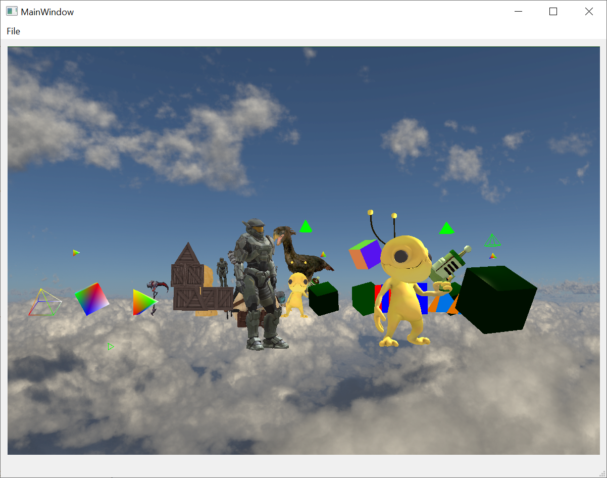

# QtAssimpOpenGlDemo

This demo project shows loading 3D models into a QOpenGL widget using the Assimp library. The code is based on the project `Qtk` by [Shaun M Reed](https://github.com/shaunrd0/qtk).

In this customization, the creation of the scene has been moved from the library to the application. This makes it possible to use the widget multiple times with different content or to create the scene once and render it multiple times from different angles, for example.

## TODO

The separation from creating the scene and the render widget in the library is not yet complete. For example, the global instance of `Input` must become a member variable of the widget instance.

## Model Artists

"Alien Hominid" (https://skfb.ly/onStx) by Nwilly_art is licensed under Creative Commons Attribution (http://creativecommons.org/licenses/by/4.0/).

"Scythe World Of Warcraft" (https://skfb.ly/6UooG) by Warcraft-3D-Models is licensed under Creative Commons Attribution (http://creativecommons.org/licenses/by/4.0/).

"Spartan Armour MKV - Halo Reach" (https://skfb.ly/6QVvM) by McCarthy3D is licensed under Creative Commons Attribution (http://creativecommons.org/licenses/by/4.0/).

"Survival Guitar Backpack (Low Poly)" (https://skfb.ly/6RnCB) by Berk Gedik is licensed under Creative Commons Attribution (http://creativecommons.org/licenses/by/4.0/).
Model by Berk Gedik, from: https://sketchfab.com/3d-models/survival-guitar-backpack-low-poly-799f8c4511f84fab8c3f12887f7e6b36
Modified (learnopengl.com) material assignment (Joey de Vries) for easier load in OpenGL model loading chapter, and renamed albedo to diffuse and metallic to specular to match non-PBR lighting setup.

"Terror-bird (NHMW-Geo 2012/0007/0001)" (https://skfb.ly/onAWy) by Natural History Museum Vienna is licensed under Creative Commons Attribution-NonCommercial (http://creativecommons.org/licenses/by-nc/4.0/).

"Golden Lion Sitting OBJ Low Poly FREE" (https://skfb.ly/onZAH) by LordSamueliSolo is licensed under Creative Commons Attribution (http://creativecommons.org/licenses/by/4.0/).
